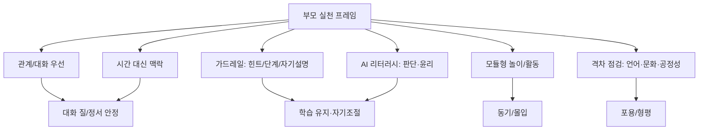

# AI_교육_논문_리뷰

[다운로드: AI_교육_논문_리뷰.md](sandbox:/mnt/data/AI_교육_논문_리뷰.md)

## Executive summary

본 조사는 2024-02-18 ~ 2026-02-18(한국시간) 발표물 중, **아동발달·스크린타임·부모중재·AI리터러시·안전/윤리·비인지역량·놀이·격차** 8개 키워드에 맞춰, **Top 50 대학 소속 저자(또는 Top50 충족이 명시된 소속)가 포함된 연구**를 우선 수집해 책 집필용으로 재구성했다. Top50 검증이 어려운 경우(출판사 접근 제한, 소속 표기 부재 등)는 “미확인/범위 밖”으로 별도 표기했다. citeturn6search7

최근 2년의 핵심 흐름을 부모 독자(7세~초등) 관점에서 요약하면 다음과 같다.  
첫째, “AI가 아이를 대신 가르친다”보다 **부모-아이 상호작용을 촉진하도록 설계된 AI(또는 로봇)**가 더 교육적으로 안전한 방향을 제시한다(가정 내 장기 배치 연구에서, 로봇의 적극적 참여가 부모-아이 대화의 질을 높였고 가정 배경에 따른 차이도 관찰됨). citeturn22view0turn22view1  
둘째, 스크린타임은 “시간”만으로 설명되지 않으며 **콘텐츠의 질/맥락(누구와, 어떤 감정으로, 무엇을 했는지)과 게임성**이 사회정서 발달과 더 촘촘히 연결된다(종단연구 메타분석에서 양방향 연관이 ‘작지만 유의’했고, 특히 게임에서 더 큰 효과가 보고됨). citeturn29view0  
셋째, 학습 도구로서 생성형 AI를 쓸 때는 **가드레일(학습을 보호하는 구조/프롬프트/순차적 스캐폴딩)**이 학습을 좌우한다(고등학교 수학 현장실험에서 “가드레일 없는” 설계가 장기 학습을 약화시킬 수 있다는 결과; 대학 강의 RCT에서 ‘교육 원리 기반’ 설계의 AI 튜터가 학습이득·동기 측면의 강점을 보였다는 결과). citeturn23search0turn23search1turn25view0turn24view1  
넷째, AI 리터러시는 “기능 사용법”보다 **판단·책임·윤리**(오류 탐지, 출처 확인, 프라이버시/공정성)를 발달 단계에 맞게 누적시키는 “경로 설계”가 중요하다는 체계적 정리가 등장했고, 초등 현장에서는 “모듈형 활동+공동설계”가 진입장벽을 낮추되 ‘콘텐츠 의존’ 위험도 함께 보고되었다. citeturn31view2turn32view1

## 조사 범위·방법

Top50 기준은 사용자가 제공한 Top50 리스트가 별도로 없으므로, **entity["organization","QS World University Rankings","university ranking | 2026"] 2026 데이터(XLSX) 기반 상위 50개 대학**을 “기준 목록”으로 가정해 적용했다. citeturn6search7  
논문별 Top50 충족 판정은 “저자 소속(affiliation)에 기준 목록의 대학이 1개 이상 포함되는가”로 판단하고, 소속이 명시된 1차 원문(PubMed/저널 랜딩페이지/PDF 첫 페이지)을 우선 근거로 삼았다. citeturn22view0turn25view0turn29view0turn32view1turn31view2

표기 편의를 위해 표에서는 대학명을 약칭으로 표기했다. 예: MIT(= entity["organization","Massachusetts Institute of Technology","university | cambridge, ma, us"]), Harvard(= entity["organization","Harvard University","university | cambridge, ma, us"]), UPenn(= entity["organization","University of Pennsylvania","university | philadelphia, pa, us"]), Stanford(= entity["organization","Stanford University","university | stanford, ca, us"]), SNU(= entity["organization","Seoul National University","university | seoul, kr"]), HKU(= entity["organization","The University of Hong Kong","university | hong kong, hk"]), UNSW(= entity["organization","The University of New South Wales","university | sydney, au"]), UQ(= entity["organization","The University of Queensland","university | brisbane, au"]), NUS(= entity["organization","National University of Singapore","university | singapore"]). citeturn6search7

데이터베이스/검색은 (1) 키워드 조합 + (2) 연도 필터 + (3) 소속 확인의 3단계로 수행했고, 결과물은 “부모 독자에게 설명 가능한 문장”으로 재서술하는 목적에 맞춰 **주제-결과-활용 포인트** 중심으로 재구성했다. citeturn22view0turn29view0turn23search0turn31view2turn32view1

## 논문 목록 표

아래 표의 “Top50 여부”는 **QS WUR 2026 Top50 기준**이며, 범위 밖이지만 부모 독자에게 매우 중요하다고 판단되는 연구는 “Top50 미해당/미확인(참고)”로 분리 표기했다. citeturn6search7

| 주제(책 챕터 제안) | 논문명(연도) | 저자·대표 소속(Top50 여부 표기) | 연구대상(연령) | 연구방법(실험/관찰/리뷰 등) | 핵심결과(한 문장) | 활용 포인트(책 문장 제안) | 원문 링크 |
|---|---|---|---|---|---|---|---|
| 부모중재·놀이·아동발달 | Social robots as conversational catalysts: Enhancing long-term human-human interaction at home (2025) | MIT Media Lab(Top50 충족) | 부모-자녀 70+쌍, 아동 3–7세 | 가정 내 1–2개월 장기 배치, 3조건 비교(수동/고정전략/전략전환) | 로봇의 적극적 참여가 부모-아이 대화의 질을 높였고, 부모 영어숙련도에 따라 최적 전략이 달랐다. citeturn22view0turn22view1 | “AI는 아이를 ‘혼자’ 가르치기보다, 부모와 아이의 대화를 더 자주·더 깊게 만드는 ‘대화 촉진 장치’로 쓸 때 가장 교육적이다.” | DOI: 10.1126/scirobotics.adk3307 citeturn22view0turn22view1 |
| 스크린타임·비인지역량·아동발달 | Electronic Screen Use and Children’s Socioemotional Problems: A Systematic Review and Meta-Analysis of Longitudinal Studies (2025) | UNSW/UQ 공저(Top50 충족) | 종단연구 132편(메타 117편), 아동·청소년 292,739명 | 체계적 문헌고찰·메타분석(양방향 연관) | 스크린 사용↔사회정서 문제는 작지만 유의한 상호연관이며, 특히 게임 사용에서 더 강했다; 가이드라인은 ‘시간’보다 ‘질/맥락’ 중심이 필요하다. citeturn29view0 | “핵심은 ‘몇 분’이 아니라 ‘무엇을, 누구와, 어떤 감정으로 했나’—특히 게임은 더 민감하다.” | DOI: 10.1037/bul0000468 citeturn29view0 |
| 생성형AI·학습설계·안전 | Generative AI without guardrails can harm learning: Evidence from high school mathematics (2025) | UPenn 저자 포함(Top50 충족) | 고등학교 수학(약 1,000명 규모 현장실험) | 현장 실험(도구 설계 비교: 기본형 vs 학습보호형) | AI 도움은 단기 성과를 높일 수 있지만, ‘가드레일 없는’ 설계는 AI가 사라진 평가에서 학습을 약화시키는 패턴이 관찰되었다. citeturn23search0turn23search1turn23search16 | “AI가 ‘답’을 빨리 주면 공부가 아니라 ‘의존’이 된다. 가드레일은 선택이 아니라 필수다.” | DOI: 10.1073/pnas.2422633122 citeturn23search0turn23search1 |
| 비인지역량·학습동기·가드레일 | AI tutoring outperforms in-class active learning: an RCT… (2025) | Harvard(Top50 충족) | 대학생(N=194) | RCT(수업형 액티브러닝 vs AI 튜터) | 교육 원리 기반으로 설계된 AI 튜터가 더 큰 학습이득과 더 높은 몰입·동기 보고를 보였고, 순차적 스캐폴딩/정확성/자기속도 등이 설계 포인트로 제시됐다. citeturn25view0turn24view1 | “좋은 AI 튜터는 ‘친절한 정답지’가 아니라 ‘순서가 있는 힌트’로 아이를 이끈다.” | DOI: 10.1038/s41598-025-97652-6 citeturn25view0turn24view1 |
| AI리터러시·안전/윤리·발달경로 | A Competency Framework for AI Literacy… (2025) | SNU(Top50 충족) | 리뷰(K-12~성인 학습자군) | PRISMA 기반 체계적 문헌고찰(29편) + 역량/경로 제안 | K-12의 핵심은 기본 이해+기기 사용+윤리이며, 학습자군별로 강조 역량이 달라지고 K-12→성인까지의 발달 경로 설계가 필요하다고 정리했다. citeturn31view2 | “AI 리터러시는 ‘사용법’이 아니라 ‘의심·확인·책임’의 습관이다.” | DOI: 10.1111/bjet.13556 citeturn31view2 |
| AI리터러시·교사/부모중재 | Exploring Primary School Teachers' Perspectives… (2025) | HKU(Top50 충족) | 초등 P4–P6 17명 + 교사 3명 | 공동설계(co-design) 기반 질적 연구 | 모듈형 자료·로우코드 도구는 진입장벽을 낮추지만, 초보 교사는 ‘콘텐츠 의존’ 위험이 있어 교사 자율성을 키우는 연수가 필요하다고 보고했다. citeturn32view1 | “AI교육 자료는 ‘정답’을 주는 교재가 아니라, 부모·교사가 아이 수준에 맞게 ‘조립’할 수 있는 모듈이다.” | HKU PDF citeturn32view1 |
| 놀이·학습경험 설계 | Scientific and Fantastical… AR + LLM (2024) | Stanford(Top50 충족) | 아동 n=50(세부 연령 원문 확인 필요) | 몰입형 AR 학습 경험 설계(LLM 개인화 조건 포함) | 문화적 맥락(스토리/신화)과 몰입형 경험에 LLM 개인화를 결합해 동기·몰입을 강화하는 설계 방향을 제시했다. citeturn16search4turn16search12 | “AI는 교과서를 대신할 때보다 ‘놀이의 시나리오’가 될 때 아이의 마음을 더 빨리 연다.” | DOI: 10.1145/3613904.3642041 citeturn16search4turn16search12 |
| 놀이·서사 기반 학습 | Oak Story: Improving Learner Outcomes with LLM-Mediated Interactive Narratives (2025) | Stanford(Top50 충족) | 초등 4–6학년(세부 N·설계 원문 확인 필요) | LLM 매개 인터랙티브 내러티브 학습 앱(출판사 접근 제한) | LLM을 ‘정답 생성기’가 아니라 ‘상호작용 서사’로 배치해 학습 몰입/이해를 높이려는 접근을 탐색했다. citeturn15search9turn12search15 | “초등에게 강한 AI 튜터는 ‘문제풀이 로봇’이 아니라 ‘이야기 속 안내자’다.” | DOI: 10.1145/3746059.3747698 citeturn15search9 |
| 부모중재·스크린타임(참고) | Parental Technology Use in a Child's Presence…: A Systematic Review (2025) | Top50 미해당(참고) | 영유아~아동 포함(연구별 상이) | 체계적 문헌고찰 | 부모의 기기 사용(technoference)이 아이 건강/발달 지표와 연관될 수 있음을 종합(인과는 제한)했다. citeturn9view0 | “아이의 스크린타임만 줄이면 끝이 아니다. ‘부모의 스크린타임’이 먼저 환경을 바꾼다.” | PubMed citeturn9view0 |
| 격차·형평성(참고) | AI and the digital divide in education (2026) | Top50 미확인(참고) | 리뷰(국가/사례 중심) | 내러티브 리뷰+개념틀 | AI 격차를 접근/기술, 알고리즘 편향, 언어·문화·제도적 매개의 복합으로 설명하는 프레임을 제시했다. citeturn28view0 | “AI 격차는 ‘기기 유무’만이 아니라 ‘내 언어/문화로 작동하는가’까지 포함한다.” | PDF citeturn28view0 |
| 안전/윤리(참고) | Understanding Generative AI Risks for Youth… (2025) | UIUC(Top50 미해당, 참고) | 청소년-챗봇 대화(344) + Reddit(30,305) | 데이터 기반 위험 분류 | 청소년-생성형AI 상호작용에서 반복적으로 나타나는 위험을 경험적 분류로 구조화했다. citeturn31view0 | “위험을 ‘이름 붙여’ 알아야 부모가 개입할 수 있다.” | arXiv PDF citeturn31view0 |
| 안전/윤리(참고) | LLMs and Childhood Safety… Safe Child-LLM Interaction (2025) | UT Austin(Top50 미해당, 참고) | 리뷰 중심 | 위험 식별+보호 프레임 제안 | 아동-LLM 상호작용의 프라이버시/발달/보안/안전 위험을 정리하고 보호 프레임을 제안했다. citeturn31view1 | “아이에게 안전한 AI는 어른용 안전을 줄인 버전이 아니다.” | arXiv PDF citeturn31view1 |

## 챕터별 핵심 논문 심층 요약

요약은 각 150~250자 수준으로, 책 문장으로 옮기기 쉬운 형태를 목표로 정리했다(원문 근거는 각 문단 끝의 링크/DOI 참조). citeturn22view0turn29view0turn23search0turn25view0turn31view2turn32view1

**가정에서의 부모중재와 놀이**  
MIT의 장기 가정 배치 연구는 “AI(로봇)가 아이를 대신 가르치는 것”이 아니라, 부모-아이 대화를 촉진하도록 설계될 때 더 교육적으로 유익할 수 있음을 보여준다. 특히 가정의 언어 배경에 따라 최적 전략이 달랐다는 점은 ‘맞춤형 중재’의 필요를 뒷받침한다. citeturn22view0turn22view1  
책 문장 제안: “AI는 아이의 공부를 ‘대신’하는 존재가 아니라, 우리 집 대화를 ‘도와주는’ 존재일 때 안전하다.”

**스크린타임과 비인지역량(정서·자기조절)**  
Psychological Bulletin 메타분석은 스크린 사용과 사회정서 문제 사이의 연관이 ‘작지만’ 양방향으로 존재하며, 특히 게임 사용이 더 민감함을 보여준다. ‘시간 줄이기’만으로는 정책/가정 지침의 초점이 부족하고, 무엇을 누구와 어떤 맥락으로 하는지가 핵심이라는 메시지가 강하다. citeturn29view0  
책 문장 제안: “스크린은 ‘시간’이 아니라 ‘맥락’으로 관리해야 한다.”

**생성형 AI를 학습도구로 쓸 때의 가드레일**  
PNAS 현장실험은 “가드레일 없는 생성형 AI”가 학습을 돕기보다 장기적으로는 학습을 해칠 수 있는 위험을 보여준다. 반대로 학습 유도형 설계(힌트·추론 유도·구조화)는 이런 문제를 완화할 수 있다는 점에서, 부모가 선택해야 할 것은 ‘AI 사용 여부’보다 ‘어떤 설계의 AI인가’로 이동한다. citeturn23search0turn23search1turn23search16  
책 문장 제안: “AI가 답을 주는 속도가 빨라질수록, 공부는 더 느려져야 한다.”

**학습동기와 자기속도: ‘좋은 튜터형 AI’의 조건**  
Harvard RCT는 동일한 교수학습 원리를 반영한 AI 튜터가 학습이득과 몰입·동기에서 강점을 보일 수 있음을 시사한다. 다만 대상이 대학생이므로, 책에서는 ‘원리(순차적 스캐폴딩, 정확성, 자기속도, 즉시 피드백)’를 초등 학습 설계(힌트 중심, 자기설명 유도)로 번역해 설명하는 방식이 적절하다. citeturn25view0turn24view1  
책 문장 제안: “아이에게 필요한 건 ‘AI’가 아니라 ‘순서가 있는 질문’이다.”

**AI 리터러시와 윤리의 발달 경로**  
SNU의 체계적 정리는 K-12에서 AI 리터러시의 핵심 축으로 ‘기본 이해+기기 사용+윤리’를 분명히 놓고, 이후 단계로 데이터/알고리즘 이해, 오류 탐지, 책임 있는 의사결정으로 확장되는 경로를 제안한다. HKU 현장 연구는 이런 목표를 교실/가정으로 옮길 때 “모듈형 활동+공동설계”가 도움이 되지만, 초보 교사는 콘텐츠 의존 위험이 있어 ‘교사·부모의 자율성(agency)’을 키우는 지원이 병행되어야 함을 보여준다. citeturn31view2turn32view1  
책 문장 제안: “AI를 ‘가르치지 않는 교육’은 결국 ‘윤리와 판단을 가르치는 교육’이다.”

## 부모 실천 프레임

다음 프레임은 표의 핵심 연구결과를 “부모 행동”으로 변환한 것이다. 각 원칙은 최소 1개 이상의 실증/리뷰 근거에 연결된다. citeturn22view0turn29view0turn23search0turn31view2turn32view1

관계 기반으로 설계한다. 아이-기기 관계를 강화하기보다 부모-아이 대화가 늘어나도록 AI를 배치하는 편이 안전하고 교육적으로 유익할 가능성이 크다. citeturn22view0turn22view1  
시간 대신 맥락을 관리한다. “몇 분”보다 “무엇을/누구와/어떤 감정으로/게임성은 어떤지”를 우선 점검한다. citeturn29view0  
정답보다 질문·힌트를 선택한다. 생성형 AI는 ‘정답 생산기’로 쓰면 장기 학습에 손해가 날 수 있으므로, 추론을 유도하는 가드레일(힌트, 단계, 자기설명)을 기본값으로 둔다. citeturn23search0turn23search1  
아이의 AI 리터러시는 “사용법”이 아니라 “판단·책임·윤리”의 습관으로 설계한다(출처 확인, 오류 탐지, 프라이버시, 공정성). citeturn31view2  
모듈형 놀이/활동으로 낮은 진입장벽을 만들되, 부모·교사 자신이 ‘조립자’가 되도록(콘텐츠 의존을 줄이도록) 훈련한다. citeturn32view1  
격차는 접근성만이 아니라 언어·문화·알고리즘 공정성까지 포함한다는 관점으로 도구를 선택하고, 다양한 관점을 요청하는 질문을 놀이처럼 반복한다. citeturn28view0turn22view0



## 검색식·재현 가능성

아래는 “복붙”을 전제로 한 검색식 예시다(기관 필터는 Scopus/ERIC 등에서 소속을 “Top50 대학명”으로 반복 적용하는 방식이 가장 재현성이 높다). citeturn6search7

```text
[Google Scholar]
("generative AI" OR "large language model" OR LLM OR ChatGPT OR "intelligent tutor*" OR "social robot*" OR "AI literacy")
AND (child* OR "primary school" OR elementary OR preschool OR "parent-child")
AND (screen time OR play OR ethics OR safety OR equity OR "socioemotional")
since:2024

[Scopus - Affiliation 예시]
AFFILORG("Harvard University") AND TITLE-ABS-KEY("AI tutor" OR "generative AI" OR "large language model") AND PUBYEAR > 2023
AFFILORG("Massachusetts Institute of Technology") AND TITLE-ABS-KEY(robot* AND parent* AND child* AND reading) AND PUBYEAR > 2023
AFFILORG("Seoul National University") AND TITLE-ABS-KEY("AI literacy" OR ethics OR "K-12") AND PUBYEAR > 2023

[PubMed 예시]
(robot*[Title/Abstract] AND parent*[Title/Abstract] AND child*[Title/Abstract])
AND ("2024/02/18"[Date - Publication] : "2026/02/18"[Date - Publication])

[arXiv 예시]
("child" OR "youth") AND ("LLM" OR "ChatGPT") AND (safety OR risk OR education) AND submittedDate:[2024-02-18 TO 2026-02-18]
```

## 우선 참고할 공식/원문 출처 목록

본 보고서의 “원문 링크”는 DOI/저널 랜딩페이지, entity["organization","PubMed","biomedical database | ncbi"], entity["organization","arXiv","preprint server | cornell"], entity["organization","Dryad","research data repository"] 등 1차 출처를 우선했다. citeturn22view0turn22view1turn31view0turn31view1  

Top50 기준 데이터는 QS WUR 2026 XLSX 공개본을 근거로 삼았다. citeturn6search7